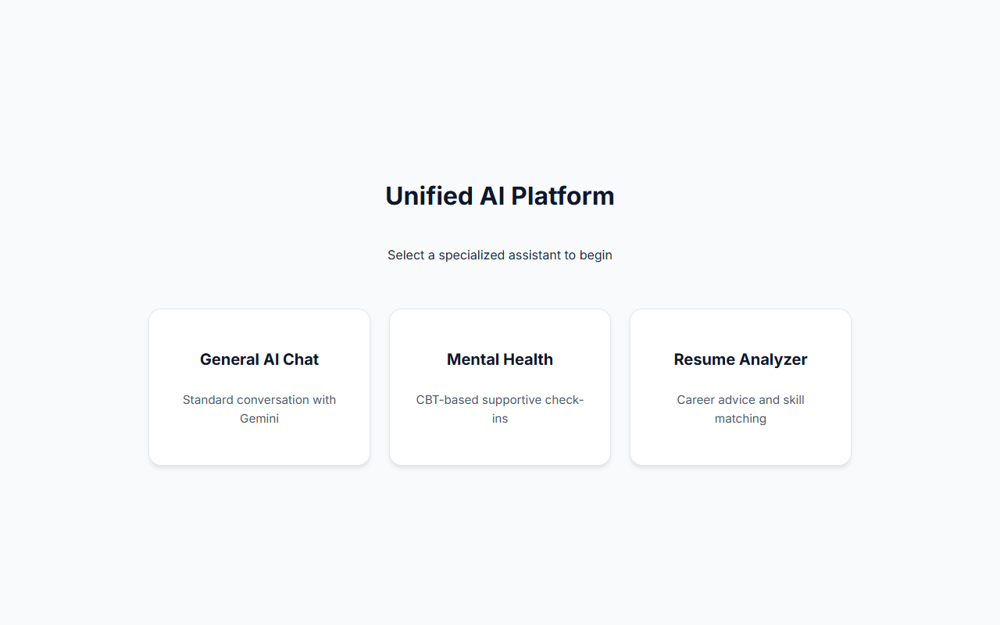
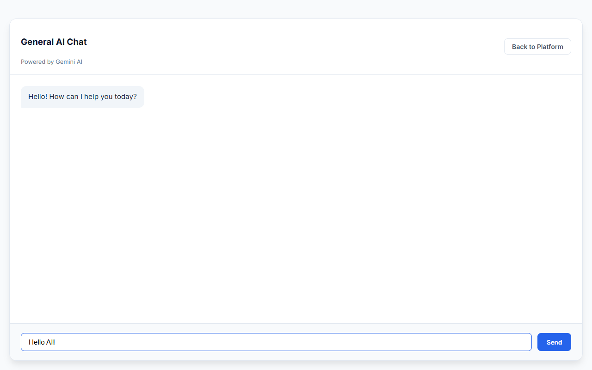
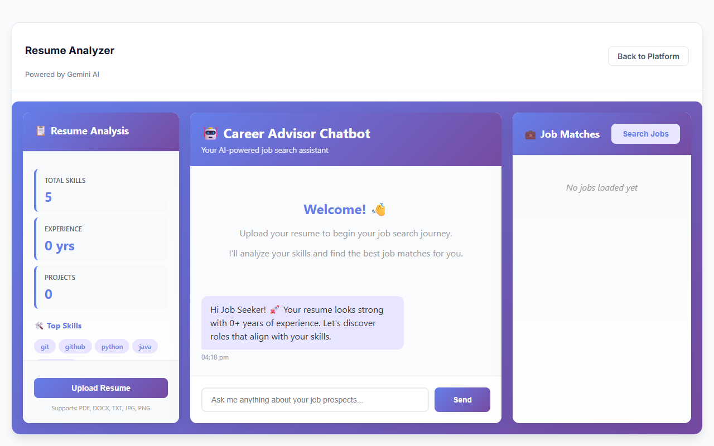

# 🌟 Unified AI Platform


> Successfully combined 3 separate AI projects into one unified, powerful application!

## 📑 Table of Contents
- [What's Included](#-whats-included)
- [Project Structure](#-project-structure)
- [Features](#-features)
  - [Unified Backend Features](#unified-backend-features)
  - [Unified Frontend Features](#unified-frontend-features)
- [Getting Started](#-getting-started)
  - [Prerequisites](#prerequisites)
  - [Setup Backend](#setup-backend)
  - [Setup Frontend](#setup-frontend)
- [Architecture Overview](#-architecture-overview)
- [Environment Variables](#-environment-variables)
- [API Response Examples](#-api-response-examples)
- [Technology Stack](#-technology-stack)
- [Contributing](#-contributing)
- [Troubleshooting](#-troubleshooting)
- [Future Enhancements](#-future-enhancements)

---

## 📦 What's Included

We've brought together three distinct AI capabilities into a single cohesive platform:

1. 💬 **General AI Chat** (Main page) - Express.js + React - General conversation powered by Google Gemini/Ollama.
2. 🧠 **Mental Health Companion** - FastAPI + React - CBT-based mental health support with integrated crisis detection.
3. 📄 **Resume Analyzer** - FastAPI + HTML/JS - Advanced resume parsing, skill extraction, and tailored job matching.

---

## 📂 Project Structure

```text
unified-ai-project/
├── backend/                          # Single unified FastAPI backend
│   ├── main.py                      # Main FastAPI app (combines all 3 backends)
│   ├── requirements.txt             # Python dependencies
│   ├── config.py                    # Configuration (resume-specific settings)
│   ├── .env.example                 # Environment variables template
│   ├── chat_service.py              # Mental health AI chat logic
│   ├── crisis_monitor.py            # Crisis detection for mental health
│   ├── database.py                  # SQLAlchemy database setup
│   ├── models.py                    # SQLAlchemy models (User, ChatHistory)
│   ├── schemas.py                   # Pydantic request/response schemas
│   ├── resume_parser.py             # Resume file parsing
│   ├── skill_extractor.py           # Skill extraction from resume text
│   ├── job_scraper.py               # Job listing scraper
│   ├── matching_engine.py           # Resume-to-job matching algorithm
│   ├── chatbot.py                   # Career advisor chatbot
│   └── uploaded_resumes/            # Directory for uploaded resume files
│
└── frontend/                        # Single unified React frontend
    ├── src/
    │   ├── App.jsx                  # Main app navigation
    │   ├── main.jsx                 # React entry point
    │   ├── index.css
    │   ├── App.css
    │   └── components/              # React components (Chat UI, Login, etc.)
    ├── package.json
    ├── vite.config.js
    ├── index.html
    └── public/
        └── resume/                  # Static resume analyzer app
```

---

## ✨ Features

### Unified Backend Features
**Single FastAPI Server (Port 8000)**

* **Mental Health Endpoints:**
  * `POST /chat` - Mental health conversation with crisis detection
  * `POST /users` - User management
  * `GET /recommendations` - Wellness recommendations
* **General Chat Endpoints:**
  * `POST /chat-general` - Generic AI chat (Gemini/Ollama)
* **Resume Endpoints:**
  * `POST /api/upload-resume` - Upload and parse resume
  * `POST /api/analyze-resume` - Extract resume data
  * `POST /api/search-jobs` - Find job listings
  * `POST /api/match-job` - Match resume to job
  * `POST /api/chat` - Resume career advisor chatbot

### Unified Frontend Features
**Single React + Vite Application (Port 5173)**

* **Welcome Screen with 3 Options:**
  1. General AI Chat
  2. Mental Health Companion  
  3. Resume Analyzer




* **Key Capabilities:**
  * Authentication (login/logout)
  * Theme toggle (light/dark)
  * Responsive design
  * Real-time chat with loading states
  * Integration with static resume analyzer







---

## 🚀 Getting Started

### Prerequisites
- Python 3.8+
- Node.js 16+
- npm or yarn

### Setup Backend

1. **Install dependencies:**
   ```bash
   cd unified-ai-project/backend
   pip install -r requirements.txt
   ```

2. **Configure environment:**
   ```bash
   cp .env.example .env
   # Edit .env with your GEMINI_API_KEY and other settings
   ```

3. **Run backend:**
   ```bash
   python -m uvicorn main:app --reload --host 0.0.0.0 --port 8000
   ```

### Setup Frontend

1. **Install dependencies:**
   ```bash
   cd unified-ai-project/frontend
   npm install
   ```

2. **Run development server:**
   ```bash
   npm run dev
   ```

The frontend will be available at: **http://localhost:5173**

---

## 🏗️ Architecture Overview

### Mental Health Integration
- Uses existing `chat_service.py` with the Gemini API.
- Crisis detection identifies urgent keywords to provide immediate help.
- SQLAlchemy database tracks conversation history.
- User management for personalized support.

### Resume Integration
- Parses multiple resume formats (PDF, DOCX, TXT, JPG, PNG).
- Extracts skills using intelligent keyword matching.
- Matches resume to job listings using a weighted algorithm.
- Career advisor chatbot provides actionable guidance.

### General Chat Integration
- Supports Google Gemini or local Ollama models.
- Falls back to a demo response when the API is unavailable.
- Request routing is based on the selected mode.

---

## ⚙️ Environment Variables

Create a `.env` file in the `backend` directory based on `.env.example`:

```env
GEMINI_API_KEY=your_api_key_here
AI_PROVIDER=gemini              # or "ollama"
DATABASE_URL=sqlite:///./mental_health.db
OLLAMA_MODEL=mistral            # if using ollama
```

---

## 💡 API Response Examples

<details>
<summary><b>Mental Health Chat</b></summary>

```json
{
  "response": "I hear you...",
  "sentiment": "positive",
  "crisis_detected": false
}
```
</details>

<details>
<summary><b>Resume Upload</b></summary>

```json
{
  "message": "Resume uploaded and analyzed successfully!",
  "resume_data": {
    "skills": ["Python", "React", "AWS"],
    "experience_years": 5,
    "education": ["Bachelor's in CS"]
  },
  "initial_greeting": "Welcome! I see you have strong skills..."
}
```
</details>

<details>
<summary><b>Job Matching</b></summary>

```json
{
  "match_percentage": 85.5,
  "matched_skills": ["Python", "React"],
  "missing_skills": ["Docker"],
  "recommendation": "Excellent match! Apply now!"
}
```
</details>

---

## 💻 Technology Stack

| Component | Technology |
|-----------|-----------|
| **Frontend** | React 19, Vite |
| **Backend** | FastAPI, Python 3.8+ |
| **Database** | SQLAlchemy, SQLite |
| **AI Models** | Google Gemini 2.5 Flash, Ollama |
| **Resume Parsing** | pytesseract, pdfplumber, python-docx |

---

## 🤝 Contributing

We welcome contributions to extend the unified platform!

1. **Add a new chatbot mode:** Update `App.jsx` and add an endpoint to `main.py`.
2. **Integrate new data sources:** Add new scraping logic to `job_scraper.py`.
3. **Enhance skill matching:** Modify `skill_extractor.py` and `matching_engine.py`.
4. **Customize UI:** Edit components in `frontend/src/components/`.

---

## 🔧 Troubleshooting

### API Key Issues
- Ensure `GEMINI_API_KEY` is properly set in `.env`.
- For demo mode, switch to Ollama or accept default demo responses.

### Database Errors
- Check `DATABASE_URL` in `.env`.
- Ensure the `uploaded_resumes/` directory exists and is writable.

### Frontend Connection Issues
- Verify the backend is running on `http://localhost:8000`.
- Check that CORS is enabled (default in `main.py`).

---

## 🔮 Future Enhancements

- [ ] PostgreSQL support with comprehensive user authentication.
- [ ] Resume upload storage and versioning.
- [ ] Real-time job market analytics dashboard.
- [ ] Personalized skill roadmap generation.
- [ ] Interactive interview preparation module.
- [ ] AI-powered cover letter generation.
- [ ] Mobile application release.

---

## 📄 License

This project is licensed under the **ISC License**. See the individual project READMEs for more details.

---
* **Created:** March 7, 2026*  
* **Status:** Complete unified integration of 3 projects into a single platform*
